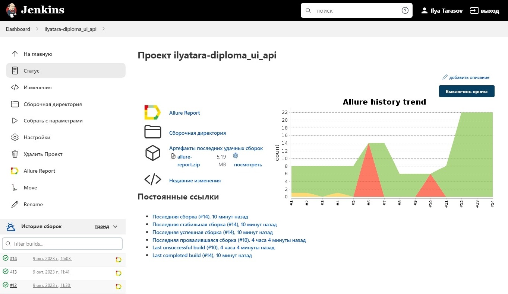
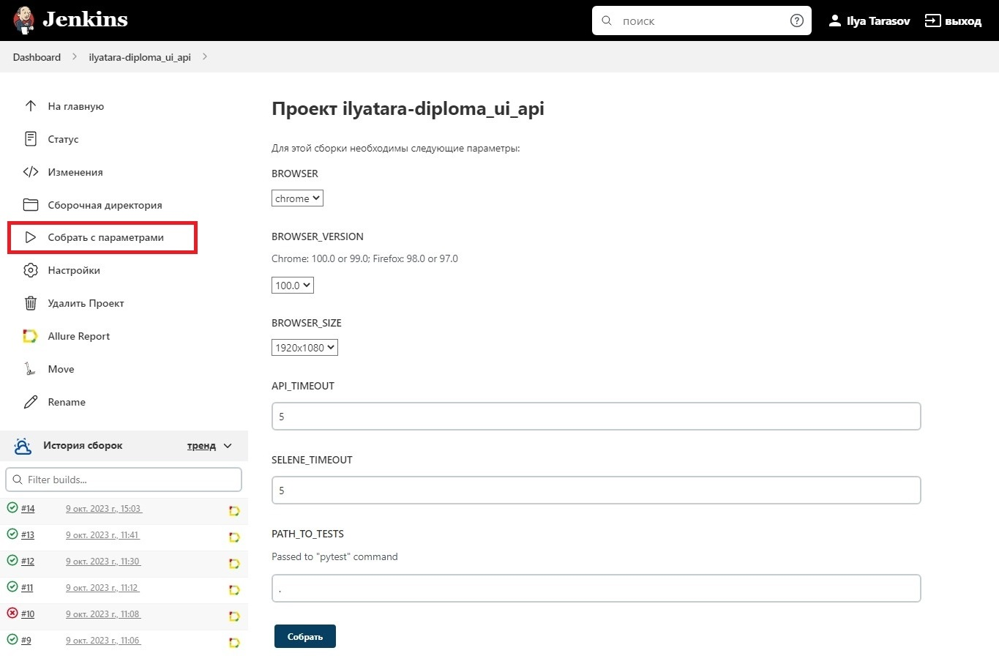
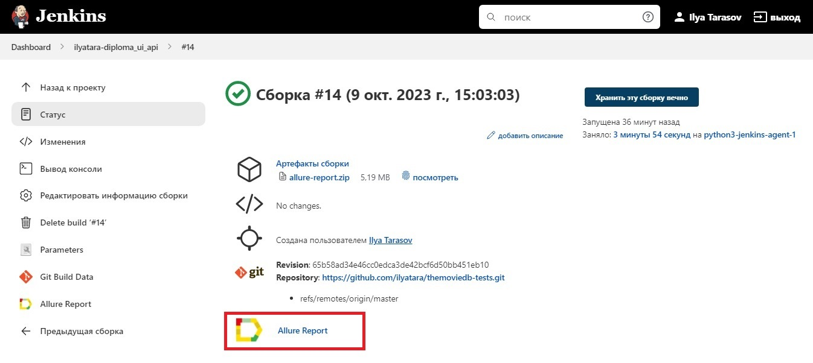
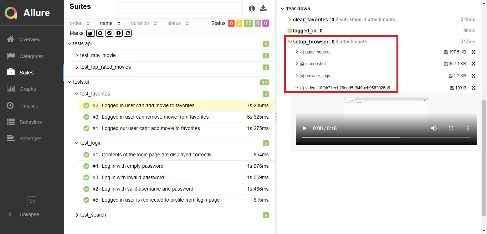
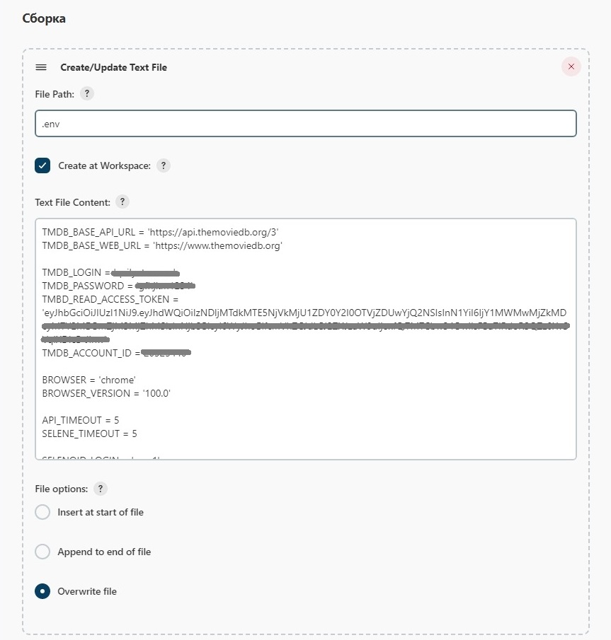
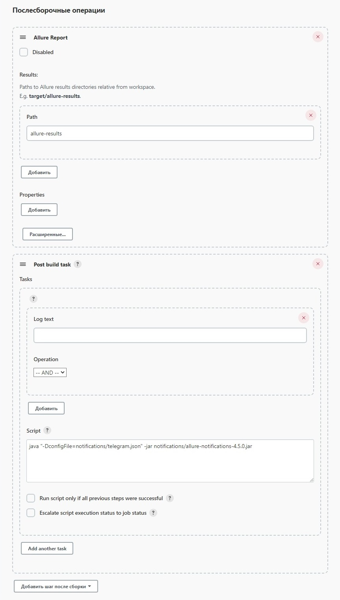
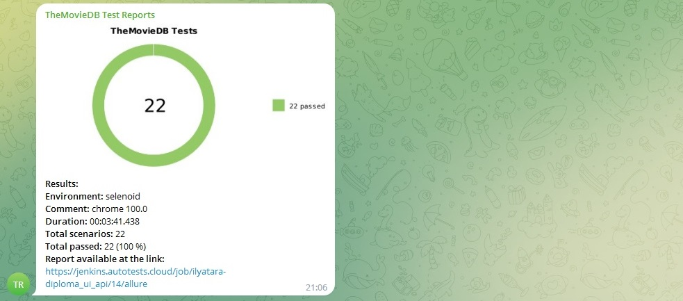

## QA.GURU: Дипломный проект

Реализация набора автотестов (UI, API) для сайта <a href="https://themoviedb.org">TheMovieDB.org</a>.

> The Movie Database (TMDB) - популярная база данных фильмов и телепередач. Все данные в ней добавляются участниками сообщества, начиная с 2008 года. Более 400 тыс. разработчиков и компаний используют ее для создания сайтов и приложений. Ежедневно она обрабатывает более 3 млрд запросов.

### Используемые технологии
<p align="center">
  <code></code>
  <code></code>
  <code></code>
  <code></code>
  <code></code>
  <code></code>
  <code></code>
  <code></code>
  <code></code>
  <code></code>
</p>

Весь проект выполнен на языке Python, а также дополнительно:

- для UI-тестов применялись: <code>Selene</code>
- для API-тестов применялись: <code>Requests</code>, <code>JSONSchema</code>

Запуск тестов осуществляется с помощью:

- <code>Jenkins</code>
- <code>Selenoid</code>

Отчёты и уведомления о результатах формируются с помощью:

- <code>Allure</code>
- <code>allure-notifications</code>


## Покрытая функциональность

### <a href="https://github.com/ilyatara/themoviedb-tests/tree/master/tests/ui">UI-тесты</a>
- Авторизация пользователя
- Поиск фильмов и людей
- Добавление фильма в **Понравившееся**

### <a href="https://github.com/ilyatara/themoviedb-tests/tree/master/tests/api">API-тесты</a>

- Получение и изменение списка оцененных пользователем фильмов
- Получение списка фильмов с наибольшим рейтингом

### <a href="https://jenkins.autotests.cloud/job/ilyatara-diploma_ui_api/">Сборка Jenkins</a>




## Запуск тестов

### Удалённый запуск

Запуск тестов на удалённой машине осуществляется с помощью скрипта:

UI-тесты:
```
python -m venv .venv
source .venv/bin/activate
pip install poetry
poetry install
context=selenoid browser=${BROWSER} browser_version=${BROWSER_VERSION} browser_size=${BROWSER_SIZE} selene_timeout=${SELENE_TIMEOUT} pytest tests/ui
```

API-тесты:
```
python -m venv .venv
source .venv/bin/activate
pip install poetry
poetry install
context=selenoid api_timeout=${API_TIMEOUT} pytest tests/api
```

Все параметры запуска, кроме "context", являются необязательными. (Если они не переданы, используются значения по умолчанию из объекта класса Config в файле <code>project.py</code>.)

В Jenkins параметры запуска передаются на странице "Собрать с параметрами":



### Локальный запуск

Локальный запуск всех тестов с дефолтными значениями конфигурационных переменных:
```
python -m venv .venv
source .venv/bin/activate
pip install poetry
poetry install
pytest .
```

При локальном запуске устанавливать переменную "context" необязательно, т.к. её значение "local" является дефолтным. Если переменная "context" имеет другое значение, её необходимо переопределить:
```
context=local pytest .
```

Подробнее о синтаксе выбора директории/файлов/тестов для запуска см. <a href="https://docs.pytest.org/en/7.1.x/how-to/usage.html">документацию PyTest</a>.


## Отчёты о прохождении тестов в Allure

### Если тест запускался локально

Находясь в корневой директории проекта, выполните команду:
```
allure serve allure-results
```

### Если тест запускался в Jenkins

Перейдите по ссылке "Allure Report" на странице сборки:




### Пример отображения тестов

При запуске API-тестов в разделе "Tear down - setup browser" прикрепляются curl запроса и body ответа.

При запуске UI-тестов прикрепляются скриншот, исходный код страницы и логи браузера.
Если тест запускался в Selenoid, также будет прикреплено видео его прохождения.



Пример видео:

https://github.com/ilyatara/themoviedb-tests/assets/135700131/446e5ee3-b705-4d03-888a-fba6d6b4d7b4


## Подготовка к запуску

### Добавление конфигурационных файлов в Jenkins

Для запуска тестов необходимо создать в корневой директории проекта файл <code>.env</code> с настройками. Пример его заполнения можно посмотреть в файле <code>.env.example</code>.

Для запуска тестов нужно зарегистрироваться на сайте https://www.themoviedb.org/ и указать логин и пароль в переменных **TMDB_LOGIN** и **TMDB_PASSWORD**.

Также для получения токена API необходимо создать приложение на странице https://www.themoviedb.org/settings/api. После создания приложения на ней в разделе "API Read Access Token" начнёт отображаться токен. Его нужно сохранить как значение настройки **TMDB_READ_ACCESS_TOKEN**.

Параметр **TMDB_ACCOUNT_ID** заполнять необязательно. Если он останется пустым, id аккаунта будет получен через API и сохранён в конфигурационном классе Config проекта в файле <code>project.py</code>.

Для удалённого запуска UI-тестов в Selenoid в настройках с префиксом **SELENOID_** нужно сохранить логин, пароль от сервиса и его базовый url.

Для добавления <code>.env</code> файла в Jenkins необходимо выбрать "Добавить файл сборки" - "Create/Update Text File" с параметрами "Create at Workspace" и "Overwrite file" и поместить его выше скрипта запуска тестов:



Для получения отчётов о прохождении тестов в Telegram нужно аналогичным образом добавить файл <code>notifications/telegram.json</code>. В нём необходимо заполнить поля "token" и "chat". Образец заполнения находится в <code>notifications/telegram.json.example</code>. Подробнее о заполнении файла см. <a href="https://github.com/qa-guru/knowledge-base/wiki/11.-%D0%A2%D0%B5%D0%BB%D0%B5%D0%B3%D1%80%D0%B0%D0%BC-%D0%B1%D0%BE%D1%82.-%D0%9E%D1%82%D0%BF%D1%80%D0%B0%D0%B2%D0%BB%D1%8F%D0%B5%D0%BC-%D1%83%D0%B2%D0%B5%D0%B4%D0%BE%D0%BC%D0%BB%D0%B5%D0%BD%D0%B8%D1%8F-%D0%BE-%D1%80%D0%B5%D0%B7%D1%83%D0%BB%D1%8C%D1%82%D0%B0%D1%82%D0%B0%D1%85-%D0%BF%D1%80%D0%BE%D1%85%D0%BE%D0%B6%D0%B4%D0%B5%D0%BD%D0%B8%D1%8F-%D1%82%D0%B5%D1%81%D1%82%D0%BE%D0%B2">инструкцию</a>.


## Получение уведомления в Telegram

### Удалённый запуск через Jenkins

Чтобы после тестового прогона в Telegram пришло уведомление с его результатами, в разделе "Послесборочные операции" после шага "Allure-report" необходимо добавить шаг "Post build task":



Скрипт для отправки уведомлений:

```
java "-DconfigFile=notifications/telegram.json" -jar notifications/allure-notifications-4.5.0.jar
```

### Локальный запуск

Для отправки уведомлений в Telegram после локального запуска необходимо выполнить команды:

```
allure generate allure-results -o allure-report
java "-DconfigFile=./notifications/telegram.json" -jar "./notifications/allure-notifications-4.5.0.jar"
```

### Пример отчёта о выполнении UI и API тестов

Для получения результатов о тестировании используется телеграм-бот. В отчёте отображаются параметры запуска тестового комплекта, время прохождения тестов, а также ссылка на Allure-отчёт:


